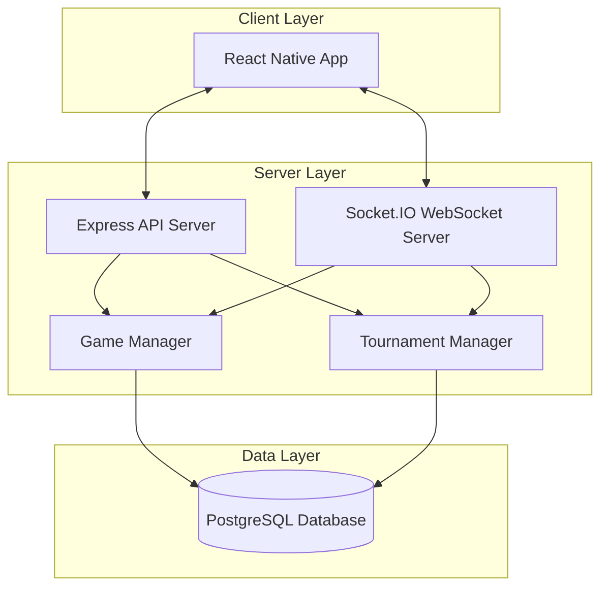

# Design Document

## Overview

The tactical multiplayer card game is designed as a client-server architecture with real-time communication. The system consists of a React Native mobile client, a Node.js Express server with Socket.IO for WebSocket communication, and a PostgreSQL database for persistence. The architecture prioritizes mobile-first experience, real-time synchronization, and scalable tournament management.

## Architecture

### High-Level Architecture



### Technology Stack

- **Frontend**: React Native
- **Backend**: Node.js with Express.js
- **Real-time Communication**: Socket.IO
- **Database**: PostgreSQL with Sequelize ORM
- **Authentication**: JWT tokens

## Components and Interfaces

### Client Components

#### Core Game Components
- **GameBoard**: Main game interface displaying player stats, cards, and game state
- **CardSelector**: Interface for selecting 3 cards per turn with visual feedback
- **TimerComponent**: Visual countdown timer for turn decisions
- **GameLog**: Scrollable log of game actions and events
- **AnimationEngine**: Handles card effects, damage, and status animations

#### Navigation Components
- **Lobby**: Main menu for creating/joining games and tournaments
- **GameRoom**: Pre-game waiting area showing players and settings
- **TournamentBracket**: Interactive tournament progression display
- **ProfileScreen**: Player statistics and match history

#### UI Components
- **EmojiResource**: Displays charges (⚡) and health (❤️) with emoji icons
- **ActionButton**: Dynamic buttons that enable/disable based on game state
- **StatusIndicator**: Shows persistent effects like burn status
- **ConnectionStatus**: Real-time connection indicator

### Server Components

#### Game Engine
```javascript
// GameEngine class methods
class GameEngine {
  createGame(gameConfig) { /* returns Game object */ }
  processCardSelection(gameId, playerId, cards) { /* processes card selection */ }
  resolveTurn(gameId) { /* returns TurnResult object */ }
  validateAction(gameId, playerId, action) { /* returns boolean */ }
  applyCardEffects(game, step) { /* applies card effects */ }
  checkWinCondition(game) { /* returns GameResult or null */ }
}
```

#### Tournament System
```javascript
// TournamentManager class methods
class TournamentManager {
  createTournament(config) { /* returns Tournament object */ }
  addPlayer(tournamentId, playerId) { /* adds player to tournament */ }
  generateBrackets(tournament) { /* returns Bracket array */ }
  advancePlayer(tournamentId, matchId, winnerId) { /* advances player */ }
  handleElimination(tournamentId, playerId) { /* handles elimination */ }
  calculateFinalRankings(tournament) { /* returns Ranking array */ }
}
```

#### WebSocket Event Handlers
```javascript
// Socket.IO event handlers
socket.on('game:join', (gameId) => { /* handle game join */ });
socket.on('game:select-cards', (cards) => { /* handle card selection */ });
socket.emit('game:state-update', gameState);
socket.emit('game:turn-result', result);

socket.on('tournament:join', (tournamentId) => { /* handle tournament join */ });
socket.emit('tournament:bracket-update', brackets);
socket.emit('tournament:match-start', matchInfo);
```

## Data Models

### Core Game Models

```javascript
// Player object structure
const Player = {
  id: '', // string
  username: '', // string
  health: 0, // number
  charges: 0, // number
  statusEffects: [], // array of StatusEffect objects
  selectedCards: [] // array of Card objects
};

// Card object structure
const Card = {
  id: '', // string
  name: '', // string
  emoji: '', // string
  cost: 0, // number
  effects: [], // array of CardEffect objects
  conditions: [] // optional array of Condition objects
};

// Game object structure
const Game = {
  id: '', // string
  players: [], // array of Player objects
  currentTurn: 0, // number
  phase: '', // 'selection' | 'resolution' | 'ended'
  turnTimer: 0, // number
  gameConfig: {}, // GameConfig object
  history: [] // array of GameAction objects
};

// GameConfig object structure
const GameConfig = {
  maxHealth: 6, // number
  turnTimeLimit: 20, // number in seconds
  bestOfSeries: 1, // number
  currentGame: 1 // number
};
```

### Tournament Models

```javascript
// Tournament object structure
const Tournament = {
  id: '', // string
  name: '', // string
  format: '', // 'single-elimination' | 'double-elimination'
  status: '', // 'waiting' | 'active' | 'completed'
  players: [], // array of TournamentPlayer objects
  brackets: [], // array of Bracket objects
  settings: {} // TournamentSettings object
};

// Bracket object structure
const Bracket = {
  type: '', // 'winner' | 'loser'
  matches: [], // array of Match objects
  currentRound: 0 // number
};

// Match object structure
const Match = {
  id: '', // string
  player1Id: '', // string
  player2Id: '', // string
  winnerId: null, // string or null
  games: [], // array of Game objects
  status: '' // 'pending' | 'active' | 'completed'
};
```

### Card Effect System

```javascript
// CardEffect object structure
const CardEffect = {
  type: '', // 'damage' | 'heal' | 'charge' | 'block' | 'status'
  value: 0, // number
  target: '', // 'self' | 'opponent'
  timing: '' // 'immediate' | 'end-of-turn'
};

// StatusEffect object structure
const StatusEffect = {
  type: '', // 'burn' | 'shield' | 'vulnerable'
  duration: 0, // number
  value: 0 // number
};
```

## Error Handling

### Client-Side Error Handling
- **Connection Errors**: Automatic reconnection with exponential backoff
- **Invalid Actions**: Visual feedback and action prevention
- **Timeout Handling**: Graceful degradation when server doesn't respond
- **State Synchronization**: Conflict resolution when client/server state diverges

### Server-Side Error Handling
- **Invalid Game Actions**: Validation and rejection with error codes
- **Player Disconnections**: Game pause and reconnection grace period
- **Database Failures**: Transaction rollback and error recovery
- **Concurrent Access**: Optimistic locking for game state updates

### Error Response Format
```javascript
// ErrorResponse object structure
const ErrorResponse = {
  code: '', // string
  message: '', // string
  details: null, // any additional data or null
  timestamp: 0 // number (Unix timestamp)
};
```

## Testing Strategy

### Unit Testing
- **Card Logic**: Test all card effects and interactions
- **Game Rules**: Validate win conditions and turn resolution
- **Tournament Logic**: Test bracket generation and advancement
- **Data Models**: Validate model constraints and relationships

### Integration Testing
- **API Endpoints**: Test all REST API functionality
- **WebSocket Events**: Validate real-time communication
- **Database Operations**: Test CRUD operations and transactions
- **Authentication**: Verify JWT token handling

### End-to-End Testing
- **Complete Game Flow**: Full 1v1 match from start to finish
- **Tournament Flow**: Multi-player tournament completion
- **Mobile UI**: Touch interactions and responsive design
- **Real-time Sync**: Multi-client synchronization testing

### Performance Testing
- **Concurrent Games**: Test multiple simultaneous matches
- **Tournament Scale**: Large tournament with many players
- **WebSocket Load**: High-frequency message handling
- **Database Performance**: Query optimization under load

## Security Considerations

### Authentication & Authorization
- JWT tokens for session management
- Role-based access for tournament administration
- Rate limiting on API endpoints
- Input validation and sanitization

### Game Integrity
- Server-side validation of all game actions
- Encrypted WebSocket communication
- Anti-cheat measures for timing and card selection
- Audit logging of all game events

### Data Protection
- Encrypted database connections
- Secure password hashing
- GDPR compliance for user data
- Regular security audits and updates

## Scalability Design

### Performance Optimization
- Database indexing for quick game lookups
- In-memory game state management
- WebSocket connection pooling
- Optimized mobile bundle size
- Database connection pooling

### Monitoring & Observability
- Application performance monitoring
- Real-time game metrics
- Error tracking and alerting
- Database performance monitoring